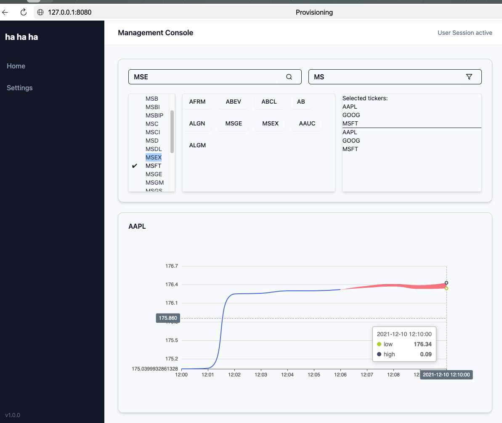

<h1 align="center">Scraping the prices</h1>

Fun and research project: want to get access to some market data, analyze trends and patterns and generate predictions with custom time-series AI model.

All this beauty running as cloudflare worker.

## Provisioning app 

in developement using Dioxus framework, so it can run as 

* localy hosted SPA (127.0.0.1:8080) _or_ 
* deployed as cloudflare page _or_ 
* run as desctop app _or_ 
* run mobile iOS | android _or_ 
* run as cli from console LOL.

we will see how it goes, now just at the beginning, will be updated often: 

